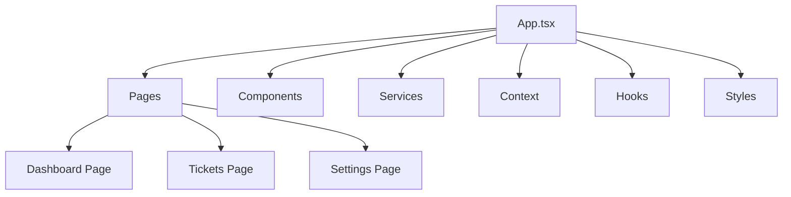

**Language:** 🇺🇸 English | [🇧🇷 Português](./README.pt-br.md)

# Central de Chamados – Frontend

### React + TypeScript Dashboard for Multi-Tenant WhatsApp Support SaaS

---

## 📌 Overview

This repository contains the frontend layer of the **Central de Chamados** system.

It provides a user interface for visualizing, managing, and interacting with customer support tickets structured from WhatsApp interactions.

The frontend is designed to:

- Consume backend APIs securely  
- Display multi-tenant data  
- Allow administrators and operators to track ticket status  
- Provide a responsive and intuitive dashboard  
- Support future integrations with AI-powered insights  

Built with **React** and **TypeScript**, the codebase is modular, maintainable, and prepared to integrate additional frameworks if needed.

---

## 🎯 Purpose

The frontend repository enables:

- Clear visualization of tickets and status  
- Interaction with backend operations  
- Administrative controls over multi-tenant environments  
- User-friendly, responsive interface  
- Integration with observability tools (metrics, logs)  

It is an essential component to turn structured backend data into actionable operational insights.

---

## 🏗 Architecture

### Core Stack

- React  
- TypeScript  
- React Router (or similar routing solution)  
- State management (Context API / Redux / Zustand)  
- Styling: CSS-in-JS, Tailwind, or preferred framework  
- API interaction via Axios or Fetch  
- Optional framework integrations as needed (Charts, UI libraries)  

### Component Structure (Proposed)

---

## 🔄 Integration with Backend

- API requests scoped per tenant  
- Authentication via JWT  
- Fetching and updating ticket information  
- Error handling and notifications  

The frontend depends on `central-de-chamados-backend` for operational data and ticket management.

---

## 🚀 Goals

- Deliver an intuitive and responsive dashboard  
- Enable multi-tenant ticket monitoring  
- Provide a foundation for AI-assisted features in the future  
- Maintain modularity and scalability  
- Ensure maintainability and code quality  

---

## 📌 Status

- Initial scaffolding with React + TypeScript complete  
- Core dashboard components under development  
- API integration in progress  
- Future plans: enhanced UI framework, charts, notifications, and AI insight panels  

---

## 🤝 Relationship with Other Repositories

- [central-de-chamados](https://github.com/Central-de-Chamados/central-de-chamados) → Architectural overview  
- [central-de-chamados-backend](https://github.com/Central-de-Chamados/central-de-chamados_backend) → API consumed by frontend  
- [central-de-chamados-infra](https://github.com/Central-de-Chamados/central-de-chamados_infra) → Supports frontend deployment and observability  

---

## 📎 Conclusion

This frontend repository is a React + TypeScript implementation of the **Central de Chamados** dashboard.

It turns structured backend data into actionable operational insights, providing a responsive, multi-tenant interface for small service operations relying on WhatsApp-based customer support.

The project is modular, scalable, and ready for future enhancements including AI-powered features.

