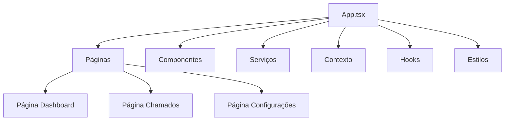

**Language:** 🇧🇷 Português | [🇺🇸 English](./README.md)

# Central de Chamados – Frontend

### Dashboard em React + TypeScript para SaaS Multi-Tenant de Atendimento via WhatsApp

---

## 📌 Visão Geral

Este repositório contém a camada de frontend do sistema **Central de Chamados**.

Ele fornece uma interface para visualizar, gerenciar e interagir com os chamados estruturados a partir de interações via WhatsApp.

O frontend foi projetado para:

- Consumir APIs do backend de forma segura  
- Exibir dados multi-tenant  
- Permitir que administradores e operadores acompanhem o status dos chamados  
- Proporcionar um dashboard responsivo e intuitivo  
- Suportar futuras integrações com insights baseados em IA  

Construído com **React** e **TypeScript**, o código é modular, de fácil manutenção e preparado para integrar frameworks adicionais se necessário.

---

## 🎯 Objetivo

O repositório de frontend permite:

- Visualização clara de chamados e status  
- Interação com operações do backend  
- Controles administrativos em ambientes multi-tenant  
- Interface amigável e responsiva  
- Integração com ferramentas de observabilidade (métricas, logs)  

É um componente essencial para transformar dados estruturados do backend em informações operacionais acionáveis.

---

## 🏗 Arquitetura

### Stack Principal

- React  
- TypeScript  
- React Router (ou solução de roteamento similar)  
- Gerenciamento de estado (Context API / Redux / Zustand)  
- Estilização: CSS-in-JS, Tailwind ou framework de preferência  
- Interação com API via Axios ou Fetch  
- Integrações opcionais com frameworks adicionais (Charts, bibliotecas de UI)  

### Estrutura de Componentes (Proposta)

## 🔄 Integração com o Backend

- Requisições API específicas por tenant  
- Autenticação via JWT  
- Consulta e atualização de informações dos chamados  
- Tratamento de erros e notificações  

O frontend depende do repositório `central-de-chamados-backend` para dados operacionais e gerenciamento de chamados.

---

## 🚀 Metas

- Entregar um dashboard intuitivo e responsivo  
- Permitir monitoramento multi-tenant de chamados  
- Criar base para funcionalidades assistidas por IA no futuro  
- Manter modularidade e escalabilidade  
- Garantir qualidade e manutenção do código  

---

## 📌 Status

- Estrutura inicial com React + TypeScript concluída  
- Componentes principais do dashboard em desenvolvimento  
- Integração com API em progresso  
- Planos futuros: framework de UI aprimorado, gráficos, notificações e painéis de insights por IA  

---

## 🤝 Relação com Outros Repositórios

- [central-de-chamados](https://github.com/Central-de-Chamados/central-de-chamados) → Visão arquitetural geral  
- [central-de-chamados-backend](https://github.com/Central-de-Chamados/central-de-chamados_backend) → API consumida pelo frontend  
- [central-de-chamados-infra](https://github.com/Central-de-Chamados/central-de-chamados_infra) → Suporte ao deploy e observabilidade do frontend  

---

## 📎 Conclusão

Este repositório de frontend é uma implementação em React + TypeScript do dashboard **Central de Chamados**.

Ele transforma dados estruturados do backend em insights operacionais acionáveis, oferecendo uma interface responsiva e multi-tenant para pequenas operações que utilizam WhatsApp como canal de atendimento.

O projeto é modular, escalável e pronto para futuras melhorias, incluindo recursos assistidos por IA.

